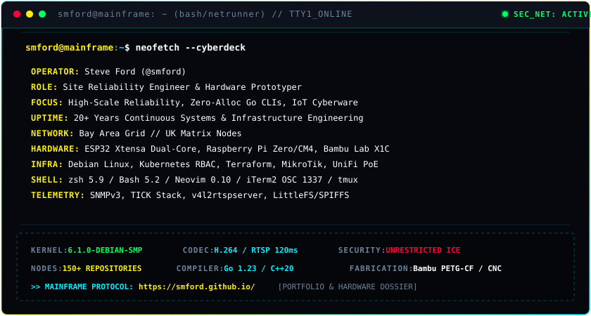

<div align="center">

```text
 ╔═════════════════════════════════════════════════════════════════╗
 ║   ███████╗███╗   ███╗███████╗ ██████╗ ██████╗ ██████╗  v9.2     ║
 ║   ██╔════╝████╗ ████║██╔════╝██╔═══██╗██╔══██╗██╔══██╗          ║
 ║   ███████╗██╔████╔██║█████╗  ██║   ██║██████╔╝██║  ██║          ║
 ║   ╚════██║██║╚██╔╝██║██╔══╝  ██║   ██║██╔══██╗██║  ██║          ║
 ║   ███████║██║ ╚═╝ ██║██║     ╚██████╔╝██║  ██║██████╔╝          ║
 ║   ╚══════╝╚═╝     ╚═╝╚═╝      ╚═════╝ ╚═╝  ╚═╝╚═════╝           ║
 ║          // NEURAL_MAINFRAME // SEC_NET: ACTIVE //              ║
 ╚═════════════════════════════════════════════════════════════════╝
```

[](https://smford.github.io/)
[](https://smford.github.io/)
[](https://smford.github.io/)
[](https://smford.github.io/)
[](https://smford.github.io/)

### `> SITE RELIABILITY ENGINEER // HARDWARE PROTOTYPER`

*Bridging low-level firmware engineering, bespoke IoT controllers, real-time telemetry, resilient distributed infrastructure, and physical CNC/timber fabrication.*

[⚡ Explore Live Cyberdeck HUD](https://smford.github.io/) • [📦 Official Homebrew Tap](https://github.com/smford/homebrew-tap) • [🔬 Live Interactive Lab Demos](https://stephenford.org/)

---

</div>

## 📟 `[01]` // SYS_DIAGNOSTICS & TELEMETRY

<div align="center">
  <a href="https://smford.github.io/">
    
  </a>
</div>

---

## ⚡ `[02]` // FEATURED PRODUCTION PROTOCOLS & HUDS

### 🛡️ SRE, Systems & High-Performance CLI Nodes

```text
┌─────────────────────────────────────────────────────────────────────────────┐
│ cidr-calculator │ Zero-dependency IPv4/IPv6 CIDR decomposition & Terraform  │
│ mdee            │ Production terminal Markdown viewer for iTerm2 (OSC 1337) │
│ delim           │ Zero-allocation terminal separator utility across streams │
│ golang-mermaid  │ Terminal Mermaid diagram renderer via Sixel, Kitty & iTerm│
│ rbac-editor     │ Client-side in-browser Kubernetes RBAC security analyzer  │
│ yaml-validator  │ SRE YAML anchor (&), alias (*) & merge key resolver       │
└─────────────────────────────────────────────────────────────────────────────┘
```

* **[smford/cidr-calculator](https://github.com/smford/cidr-calculator)** • `Go` `IPv4/IPv6` `Terraform`  
  High-performance CIDR subnetting and collision analysis engine with zero runtime allocations. Includes an interactive web playground and automated Terraform IaC export for VPC provisioning.  
  ↳ *[Launch Live Playground](https://stephenford.org/cidr-calculator/)*

* **[smford/mdee](https://github.com/smford/mdee)** • `Go` `iTerm2 OSC 1337` `Terminal CLI`  
  Production-grade terminal Markdown viewer supporting inline raster graphics via OSC 1337 escape codes, Unicode box-drawing tables, EPIPE signal safety, and syntax-highlighted code fences.  
  ↳ *[View Documentation](https://stephenford.org/mdee/)*

* **[smford/rbac-editor](https://github.com/smford/rbac-editor)** • `TypeScript` `Kubernetes RBAC` `Zero-Telemetry`  
  In-browser Kubernetes RBAC security analyzer. Parses manifests into ASTs, resolves ServiceAccount cluster privileges, flags privilege escalation risks, and runs entirely client-side with zero data egress.  
  ↳ *[Launch Security Analyzer](https://stephenford.org/rbac-editor/)*

* **[smford/yaml-web-validator](https://github.com/smford/yaml-web-validator)** • `TypeScript` `YAML AST` `Offline PWA`  
  Client-side YAML IDE for SREs to audit and dereference complex YAML trees, anchors, aliases, and merge keys, with built-in plaintext credential and entropy detectors.  
  ↳ *[Launch YAML Clean](https://stephenford.org/yaml-web-validator/)*

* **[smford/delim](https://github.com/smford/delim)** & **[smford/golang-mermaid](https://github.com/smford/golang-mermaid)** • `Go` `Sixel` `Kitty`  
  Lightweight utilities for rich terminal pipelines, from zero-overhead output demarcation to high-resolution vector diagram rendering directly on modern GPU-accelerated terminal emulators.

---

### 📡 Embedded Cyberware, IoT Telemetry & Industrial Interlocks

* **[smford/esp32-asyncwebserver-fileupload-example](https://github.com/smford/esp32-asyncwebserver-fileupload-example)** • ★ 104+  
  Asynchronous web server for ESP32 microcontrollers featuring multi-file drag-and-drop LittleFS/SPIFFS uploads with real-time WebSocket progress telemetry.

* **[smford/raspberry-pi-streaming-camera](https://github.com/smford/raspberry-pi-streaming-camera)** • ★ 83+  
  Sub-120ms ultra-low latency RTSP camera pipeline on Raspberry Pi Zero W utilizing `v4l2rtspserver` hardware H.264 encoding and Nginx for hostile laser cutter enclosure telemetry.

* **[smford/eeh-esp32-rfid](https://github.com/smford/eeh-esp32-rfid)** • `Embedded C++` `ESP32` `Hardware Relays`  
  Heavy machinery RFID lockout sentry deployed at East Essex Hackspace, featuring optocoupled galvanic isolation to safely switch 3kW industrial 230V workshop saws upon card authentication.

* **[smford/rpi-snmpd-configuration](https://github.com/smford/rpi-snmpd-configuration)** • ★ 14+  
  Hardened SNMP daemon distribution for Raspberry Pi SBCs exposing hardware thermal sensors, throttle states, and OS vitals into network monitoring platforms.

* **[smford/esp32-temp-monitor](https://github.com/smford/esp32-temp-monitor)** • `1-Wire` `Pushover API`  
  Closed-loop microclimate thermal regulation unit cycling refrigeration relays with dual DS18B20 multi-drop sensors and instant threshold push alerts.

---

### 🌌 Relativistic Shaders, Creative Web & Retro Emulation

* **[smford/blackhole](https://github.com/smford/blackhole)** • `WebGL 2.0` `GLSL Shaders` `Astrophysics`  
  *Chandra-X*: Relativistic Schwarzschild black hole simulator executing general relativistic raymarching, gravitational photon bending, and Doppler beamed accretion disk thermodynamics in real time.  
  ↳ *[Execute Simulator](https://stephenford.org/blackhole/)*

* **[smford/fly-around-the-moon](https://github.com/smford/fly-around-the-moon)** • `Three.js` `WebGL` `LOD Engine`  
  Interactive 3D Moon exploration platform with dynamic Level-of-Detail terrain rendering, sub-kilometer surface photography, and precision Selenographic coordinates.  
  ↳ *[Launch Orbital Mission](https://stephenford.org/fly-around-the-moon/)*

* **[smford/matrix-rain](https://github.com/smford/matrix-rain)** & **[smford/matrix-cat](https://github.com/smford/matrix-cat)** • `Go` `VT100` `TrueColor`  
  Authentic Matrix digital rain simulator and cascading source code viewer in Go featuring half-width Katakana glyphs, 24-bit RGB fading tails, and zero screen corruption guarantees.  
  ↳ *[Stream Live Matrix](https://stephenford.org/matrix-rain/)*

* **[smford/pcboard-web-emu](https://github.com/smford/pcboard-web-emu)** • `HTML5 Canvas` `Web Audio DSP`  
  Cycle-accurate retro BBS emulation replicating an IBM PC running MS-DOS 6.22 dialing into Clark Development PCBoard v15.22 with synthesized Hayes modem handshake frequencies.  
  ↳ *[Dial BBS Node](https://stephenford.org/pcboard-web-emu/)*

---

### 📐 3D Printing, CAD Enclosures & Timber Fabrication

* **[Sunton-ESP32-2432S028R-Case](https://github.com/smford/Sunton-ESP32-2432S028R-Case)**: Parametric enclosure remix for 2.8" ESP32 touch controller with brass heat-set inserts and DIN/VESA fixtures.
* **[emergency-stop-holder](https://github.com/smford/emergency-stop-holder)**: Industrial workshop wall mount for standard 22mm mushroom safety switches (printed in carbon-fiber reinforced PETG).
* **[bambu-poop-chute-magnet-remix](https://github.com/smford/bambu-poop-chute-magnet-remix)**: Snap-lock purge chute for Bambu Lab X1/P1 printers with countersunk neodymium retention magnets.
* **Timber Rafter & Outbuilding CAD Engine**: Sub-millimeter mathematical solver for dual-pitch birdsmouth hip timber cuts, joist deflection load calculation, and structural drainage schedules.

---

## 🍺 `[03]` // DEPLOY VIA HOMEBREW TAP

Install my command-line tools on macOS or Linux with zero dependencies:

```bash
# Tap the official repository
brew tap smford/tap

# Install systems & SRE tools
brew install cidr-calculator
brew install mdee
brew install delim

# Install Matrix visualizers
brew install matrix-rain
brew install matrix-cat
```

---

## 🔬 `[04]` // WORKSHOP BENCH & LAB INVENTORY

| `[01]` Rapid Fabrication Lab | `[02]` Embedded Systems Bench | `[03]` Network & Backbone |
| :--- | :--- | :--- |
| • Bambu Lab X1-Carbon (PETG-CF)<br>• Heavy CNC Gantry Timber Router<br>• Optical CO2 Laser Cutter CNC<br>• Autodesk Fusion 360 Parametric | • ESP32 Xtensa Dual-Core 240MHz<br>• Raspberry Pi CM4 & Pi Zero W<br>• 13.56MHz RFID SPI Access Buses<br>• Logic Analyzers & Opto Relays | • Ubiquiti UniFi PoE Network Mesh<br>• MikroTik RouterOS v7 Core<br>• Isolated VLANs & Zero-Trust ICE<br>• Home Assistant Local Zigbee Mesh |

---

## 📊 `[05]` // GITHUB NETWORK METRICS

<div align="center">


</div>

